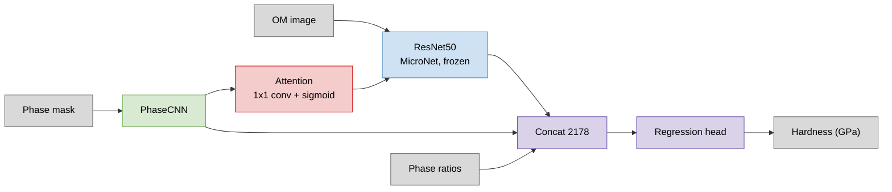
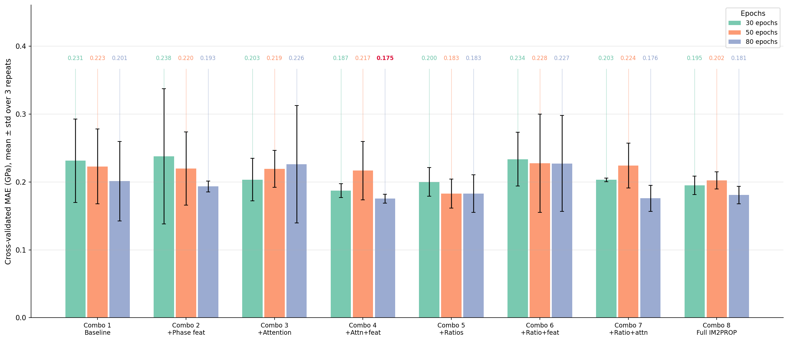
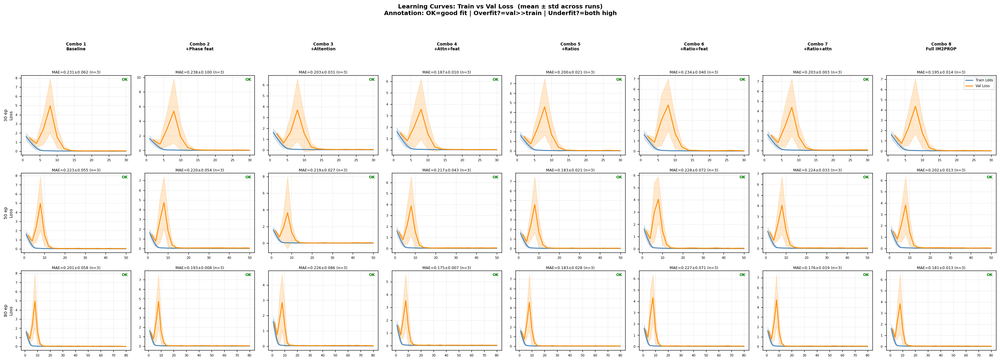
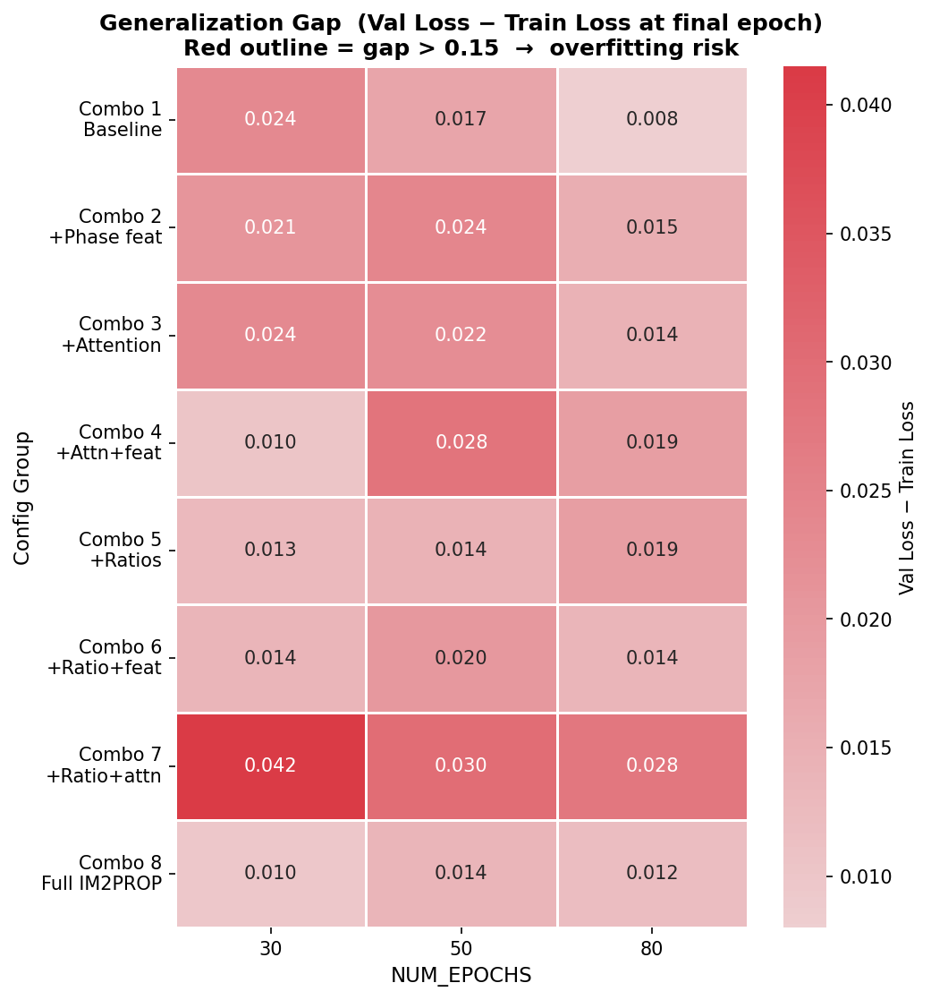
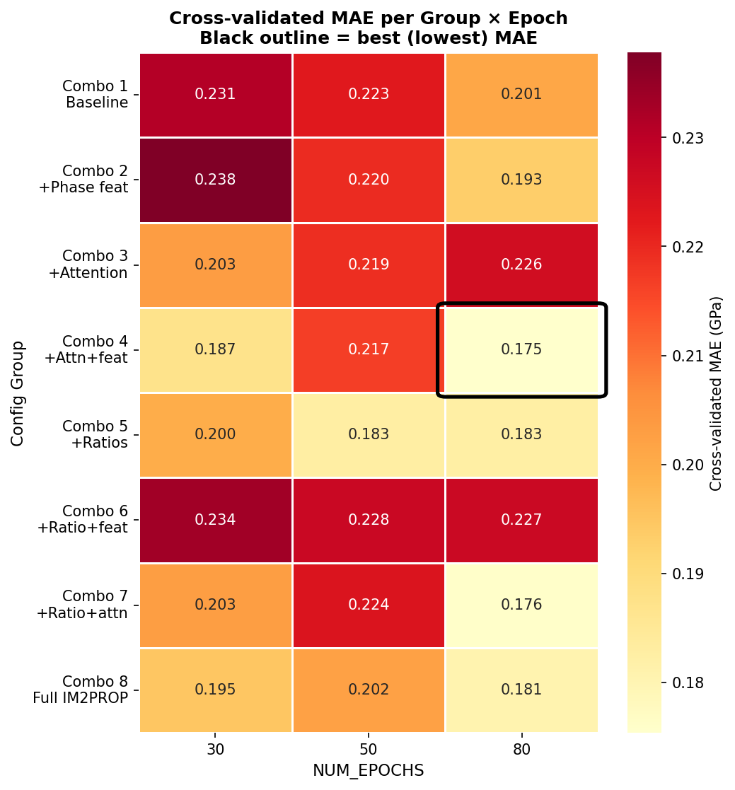

# From Image to Properties (IM2PROP): Deep Learning for Microstructure Property Prediction

**[Project page](https://jaychou04.github.io/IM2PROP/)**

Code and data to reproduce the ablation study from the paper. IM2PROP predicts
Micro-Vickers hardness of S32205 duplex stainless steel from optical microscope
images by fusing three branches: a MicroNet-pretrained ResNet50 encoder, a
PhaseCNN over the binary phase mask, and the macroscopic phase ratios.

Method, dataset construction and discussion are in the paper; this repository
covers reproduction.



Three components are independently switchable — phase ratios (R), spatial
attention (A), PhaseCNN features (F) — giving the 8 combinations in the results
table. Disabled branches are zeroed rather than removed, so the architecture is
identical across all of them.

## Install

```bash
git clone https://github.com/JayChou04/IM2PROP.git
cd IM2PROP
uv sync
```

A CUDA GPU is required for a practical runtime. `torch` and `torchvision` are
pinned to CUDA 12.8 builds from PyTorch's index, which publishes wheels for Linux
(x86_64, aarch64) and Windows only. On macOS or a CPU-only machine, remove the
`[[tool.uv.index]]` block and the `torch` / `torchvision` lines under
`[tool.uv.sources]` in `pyproject.toml`, then re-run `uv lock && uv sync`.

## Reproduce

```bash
bash reproduce.sh
```

Regenerates every figure from the 94 source images:

| Stage | Step | Time |
|---|---|---|
| 1 | Extract phase masks and phase ratios | ~1 min |
| 2 | Ablation sweep, 360 runs | ~15 h |
| 3 | Verify the run matrix is complete | instant |
| 4 | Pool cross-validation folds | ~1 min |
| 5 | Render figures and tables into `docs/assets/` | ~1 min |

Resume-safe — completed runs are skipped, so an interrupted job restarts with the
same command. `--smoke` runs a single short job end to end; `--dry-run` lists the
planned runs without executing them. No Weights & Biases account is needed; the sweep logs offline.

### Shorter runs

`--repeats` trades precision for time:

| Command | Runs | Time |
|---|---:|---:|
| `bash reproduce.sh --repeats 1` | 120 | ~5 h |
| `bash reproduce.sh --repeats 2` | 240 | ~10 h |
| `bash reproduce.sh` | 360 | ~15 h |

Repeat seeds are drawn in a fixed order, so a shorter run is a prefix of a longer
one: raising the count later reuses the completed runs rather than discarding
them. Pass the same `--repeats` value when checking status, so the completeness
gate expects the right number.

### Evaluation

With 94 specimens, a single held-out split leaves too few samples for a stable
score, so the sweep uses **5-fold cross-validation with 3 repeats**:

```
8 combos x 3 epoch settings x 3 repeats x 5 folds = 360 runs
```

Check progress or completeness at any time:

```bash
uv run scripts/sweep_status.py --report
```

## Results

Cross-validated MAE in GPa, pooled over all 94 specimens and averaged across the
3 repeats.

| Combo | R | A | F | 30 epochs | 50 epochs | 80 epochs |
|---|:-:|:-:|:-:|:---:|:---:|:---:|
| 1 Baseline | 0 | 0 | 0 | 0.2312 | 0.2227 | 0.2011 |
| 2 +Phase feat | 0 | 0 | 1 | 0.2378 | 0.2197 | 0.1933 |
| 3 +Attention | 0 | 1 | 0 | 0.2034 | 0.2192 | 0.2261 |
| 4 +Attn+feat | 0 | 1 | 1 | 0.1872 | 0.2166 | **0.1754** |
| 5 +Ratios | 1 | 0 | 0 | 0.2000 | 0.1828 | 0.1827 |
| 6 +Ratio+feat | 1 | 0 | 1 | 0.2335 | 0.2275 | 0.2272 |
| 7 +Ratio+attn | 1 | 1 | 0 | 0.2030 | 0.2241 | 0.1760 |
| 8 Full IM2PROP | 1 | 1 | 1 | 0.1949 | 0.2024 | 0.1807 |

The lowest MAE is **Combo 4 (+Attention +Phase features) at 80 epochs, 0.1754
GPa**, against 0.2011 for the RGB-only baseline at the same setting — a reduction
of 0.0256 GPa, or 12.7%. Six of the twenty-one combination-by-epoch cells score
above the baseline, so the table is best read cell by cell.

Longer training helps consistently: 80 epochs beats 30 in 20 of 24
combination-by-repeat comparisons.









## Citation

```bibtex
@unpublished{chou2026im2prop,
  title  = {From Image to Properties: Deep Learning for Microstructure Property Prediction},
  author = {Chou, Shih-Chieh and Cheng, I-Chieh and Li, Bo-Shiuan},
  note   = {Manuscript},
  year   = {2026},
  url    = {https://jaychou04.github.io/IM2PROP/}
}
```

Supported by the College Student Research Grant, National Science and Technology
Council (NSTC), Taiwan, under Grant No. 114-2813-C-110-052-E.

## License

MIT — see [LICENSE](LICENSE).
